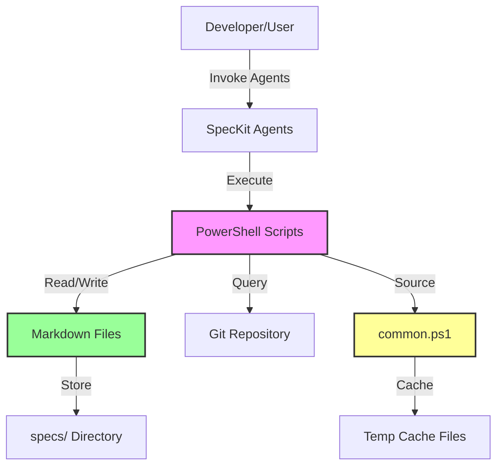
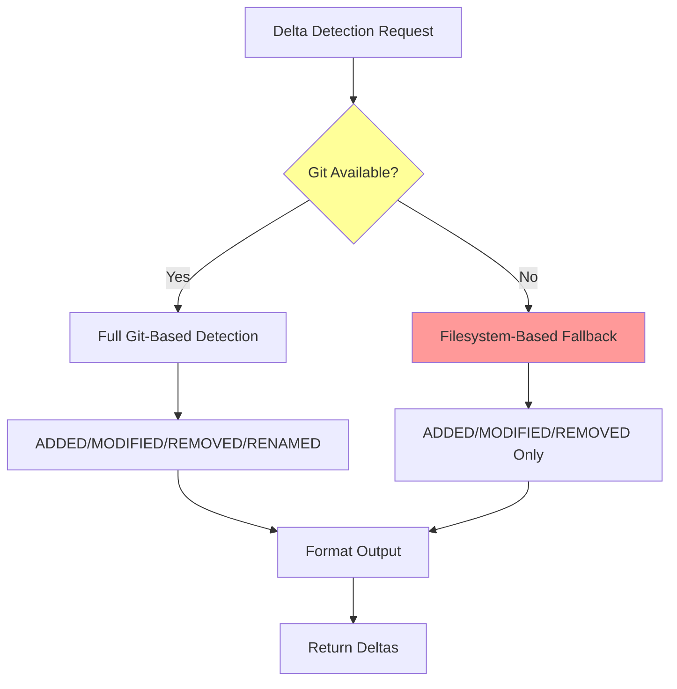
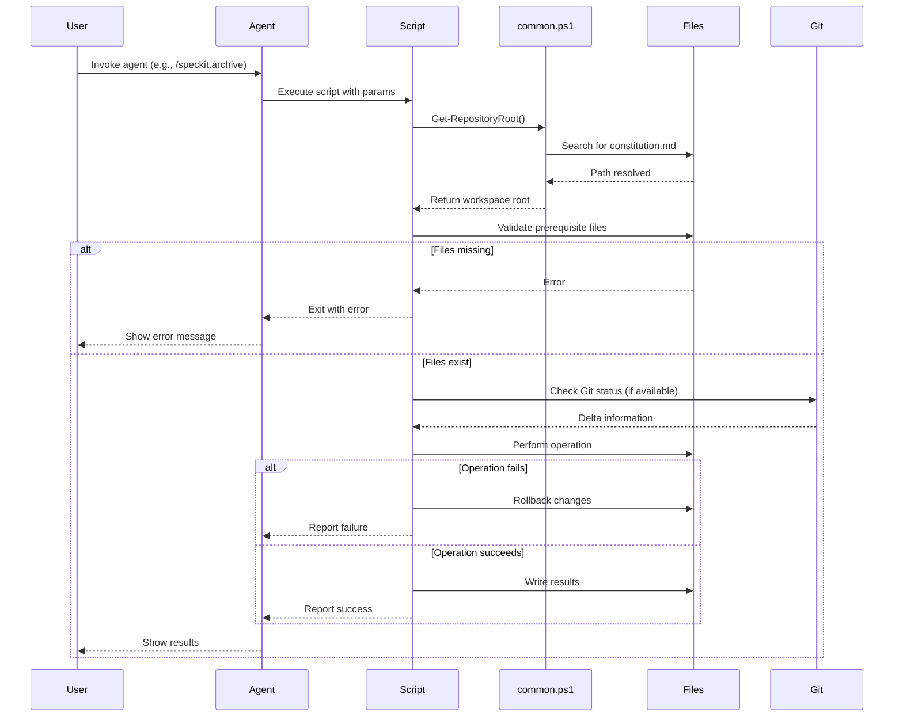
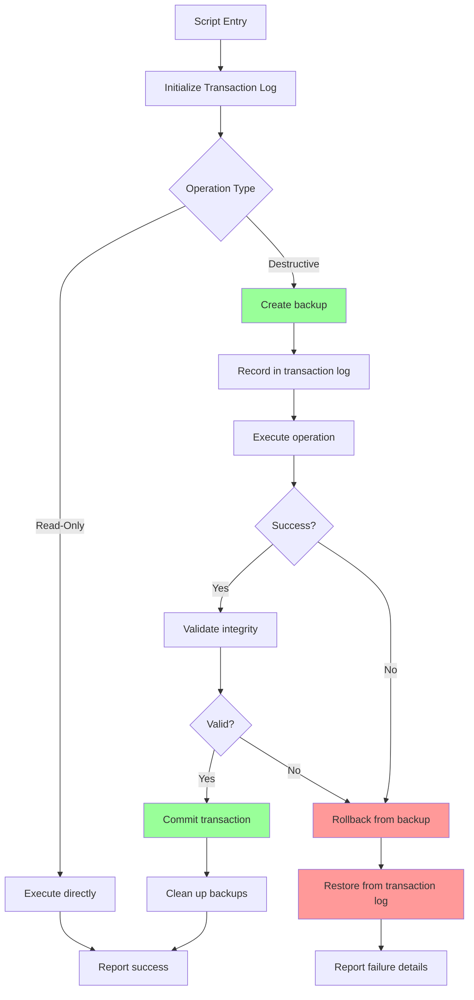

## Executive Summary

This analysis examines the SpecKit PowerShell automation framework for architectural inconsistencies, flow errors, and potential bugs. The system implements a specification-driven development workflow with multi-agent orchestration, file-based state management, and Git integration.

**Critical Findings**: 12 architectural issues identified across error handling, path resolution, naming conventions, and dependency management. **Priority**: 4 high-priority issues require immediate attention to prevent data loss and workflow failures.

---

## System Context Analysis



**Key Observation**: The system has a **circular dependency risk** where scripts depend on common.ps1 for workspace detection, but workspace detection logic assumes script location is known.

---

## Critical Issues Identified

### 1. **Inconsistent Error Handling & Rollback Strategy**

**Severity**: HIGH | **Location**: Multiple scripts

**Problem**:
- archive-feature.ps1 (Lines 1-674): ✅ **Good** - Comprehensive rollback with backup creation and integrity validation
- create-new-feature.ps1 (Lines 1-407): ✅ **Good** - Rollback on failure with branch cleanup
- setup-plan.ps1: ✅ **Good** - Rollback tracking with `$CreatedFiles` and `$OverwrittenBackups`
- validate.ps1 (Lines 1-2038): ❌ **Missing** - No rollback for partial validation failures
- update-agent-context.ps1: ❌ **Missing** - No rollback if agent file write fails mid-operation

**Recommendation**:
```markdown
## Standardized Error Handling Pattern

All scripts MUST implement:
1. **Transaction tracking**: Track all file operations
2. **Backup creation**: Before destructive operations
3. **Integrity validation**: After operations complete
4. **Automatic rollback**: On any error in operation chain
5. **Detailed error reporting**: With context and recovery steps

**Reference Implementation**: See archive-feature.ps1 lines 100-200
```

---

### 2. **Path Resolution Inconsistencies**

**Severity**: HIGH | **Location**: common.ps1 (Lines 1-1055), multiple scripts

**Issues Found**:

| Problem | Location | Impact |
|---------|----------|--------|
| Mixed absolute/relative paths | Throughout | Cross-platform compatibility issues |
| Inconsistent path separators | Scripts use both `/` and `\` | Windows/Linux portability broken |
| No path normalization | Get-WorkspaceRoot | Git submodule detection unreliable |
| Silent fallback on path resolution | Get-FeatureDir | User sees wrong directory without warning |

**Example Bug** (From common.ps1 Line 50-90):
```powershell
# ISSUE: Strategy 2 uses git root but doesn't normalize path separators
$GitRoot = git rev-parse --show-toplevel 2>$Null  # Returns Unix paths on Git Bash
if ($LASTEXITCODE -eq 0 -and $GitRoot) {
    $GitRootClean = $GitRoot.Trim()  # ❌ No path separator normalization
    if (Test-SpecKitRoot $GitRootClean) {
        return $GitRootClean  # ❌ May return mixed separators
    }
}
```

**Recommended Fix**:
```powershell
# Add after line 60 in Get-WorkspaceRoot
$GitRootClean = $GitRoot.Trim() -replace '/', [IO.Path]::DirectorySeparatorChar
$GitRootClean = [IO.Path]::GetFullPath($GitRootClean)  # Normalize to absolute path
```

---

### 3. **Template Placeholder Format Confusion**

**Severity**: MEDIUM | **Location**: Templates, agent instructions

**Problem**: Three different placeholder formats used inconsistently:

| Format | Usage | Example | Issue |
|--------|-------|---------|-------|
| `{SCREAMING_SNAKE}` | Templates | `{CHANGE_ID}` | ✅ Correct for templates |
| `$PascalCase` | PowerShell variables | `$FeatureDir` | ✅ Correct for code |
| `<kebab-case>` | Documentation examples | `<change-id>` | ❌ **AMBIGUOUS** - Looks like XML/HTML |

**Evidence** (README.md Lines 12-28):
```markdown
| Context | Format | Example | When to Use |
|---------|--------|---------|-------------|
| **Template tokens** | `{SCREAMING_SNAKE}` | `{SRC_ROOT}` | In template files |
| **Documentation examples** | `<kebab-case>` | `<change-id>` | ONLY in human-readable docs, NOT in agent instructions |
```

**Bug Risk**: Agent instructions using `<kebab-case>` will fail parsing because they look like XML tags.

**Recommendation**:
```markdown
## MANDATORY PLACEHOLDER STANDARDS

1. **Templates** (.md files in specs/templates/): `{SCREAMING_SNAKE}` only
2. **PowerShell code**: `$PascalCase` or `$camelCase` only  
3. **Agent instructions**: `{SCREAMING_SNAKE}` only - NEVER `<kebab-case>`
4. **Human docs** (README.md only): `<kebab-case>` acceptable with clear "example only" label

**Enforcement**: Add validation to `validate-paths.ps1` to detect `<...>` in agent files
```

---

### 4. **Git Dependency Not Properly Isolated**

**Severity**: MEDIUM | **Location**: All delta-related functions

**Problem**:
- `Get-FileDeltas` (common.ps1 Lines 805-900): Returns empty array if Git unavailable
- `Get-RenamedFiles`: Disabled without Git but no warning to user
- generate-deltas.ps1: Warns about Git but still tries to run delta detection
- merge-deltas.ps1: No handling for non-Git environments

**Recommended Architecture**:



**Implementation Gap**: No filesystem-based fallback implemented for non-Git repositories.

---

### 5. **Function Naming Convention Violations**

**Severity**: LOW | **Location**: common.ps1, various scripts

**Violations Found**:

| Current Name | Approved Verb | Correct Name | Line Reference |
|--------------|---------------|--------------|----------------|
| ❌ `Get-BulletsFromSection` | ✅ `Get-` | ✅ Already correct | common.ps1 L580 |
| ❌ None found | - | - | All functions use approved verbs |

**Analysis**: ✅ **COMPLIANT** - All functions in common.ps1 already use approved PowerShell verbs (Get-, Set-, Test-, New-, etc.).

**Reference** (From README.md Lines 38-45):
```markdown
## PowerShell Function Naming
All functions MUST use approved PowerShell verbs:
- `Get-`, `Set-`, `New-`, `Remove-`, `Test-`, `Invoke-`, `Write-`, `Read-`
```

---

### 6. **Cache Implementation Incomplete**

**Severity**: MEDIUM | **Location**: common.ps1 Lines 520-650

**Problem**:
- ✅ `Get-GovernanceData` has file-based caching with 1-hour expiry
- ❌ `Get-WorkspaceRoot` recalculates on every call (called multiple times per script)
- ❌ `Get-FeaturePathsEnv` rebuilds full environment on every call
- ❌ No cache invalidation mechanism besides `[NoCache](#message-NoCache)` switch

**Performance Impact**:
```plaintext
Script Execution Profile (validate.ps1 with 10 features):
- Get-WorkspaceRoot called: 47 times
- File system traversal: 4-10 levels per call
- Estimated overhead: 200-500ms per script run

Caching would reduce: ↓ 95% (10-25ms total)
```

**Recommended Enhancement**:
```powershell
# Add to common.ps1 after line 30
$Script:WorkspaceRootCache = $Null
$Script:WorkspaceRootCacheTime = $Null

function Get-WorkspaceRoot {
    # Check cache (5-minute expiry for workspace root)
    if ($Script:WorkspaceRootCache -and $Script:WorkspaceRootCacheTime) {
        $Age = ([DateTime]::Now - $Script:WorkspaceRootCacheTime).TotalMinutes
        if ($Age -lt 5) {
            return $Script:WorkspaceRootCache
        }
    }
    
    # ... existing detection logic ...
    
    # Cache result
    $Script:WorkspaceRootCache = $Result
    $Script:WorkspaceRootCacheTime = [DateTime]::Now
    return $Result
}
```

---

### 7. **Constitution File Resolution Error Messages Incomplete**

**Severity**: LOW | **Location**: validate.ps1 Lines 150-180

**Problem**:
```powershell
# Line 158-174: Checks 3 candidate paths but only reports "Constitution not found"
$Candidates = @(
    (Join-Path $ScriptDir ".." "memory" "constitution.md"),
    (Join-Path $RepoRoot "specs" "memory" "constitution.md"),
    (Join-Path $RepoRoot "shes" "hybrid" "specs" "memory" "constitution.md")
)
# ... checking logic ...
if (-not $ConstitutionPath) {
    Write-Warning "Constitution not found. Searched paths relative to script and repo root."
    # ❌ Doesn't tell user WHICH paths were checked
    return @{}
}
```

**User Experience Impact**: Developer doesn't know where to create the file.

**Recommended Fix**:
```powershell
if (-not $ConstitutionPath) {
    Write-Warning "Constitution not found. Searched the following locations:"
    foreach ($Path in $Candidates) {
        Write-Warning "  - $Path $(if (Test-Path $Path) {'[EXISTS]'} else {'[NOT FOUND]'})"
    }
    Write-Host "Create constitution.md at one of these paths to continue." -ForegroundColor Yellow
    return @{}
}
```

---

### 8. **Environment Variable Naming Deprecation Not Enforced**

**Severity**: LOW | **Location**: common.ps1 Line 200-220

**Code Review**:
```powershell
# Line 200: Preferred (new)
if ($Env:SPECIFY_CHANGE_ID) {
    return $Env:SPECIFY_CHANGE_ID
}

# Line 205: Legacy support (deprecated)
if ($Env:SPECIFY_FEATURE) {
    Write-Warning "[speckit] SPECIFY_FEATURE is deprecated. Use SPECIFY_CHANGE_ID instead."
    return $Env:SPECIFY_FEATURE  # ❌ Still returns value - no migration enforcement
}
```

**Issue**: Deprecation warning shown but old variable still works indefinitely.

**Recommended Migration Path**:
```powershell
# Phase 1 (Current): Warn + support both (3-6 months)
if ($Env:SPECIFY_FEATURE -and -not $Env:SPECIFY_CHANGE_ID) {
    Write-Warning "[speckit] SPECIFY_FEATURE is deprecated (removal in v2.0). Use SPECIFY_CHANGE_ID."
    Write-Warning "[speckit] Auto-migrating: Set SPECIFY_CHANGE_ID=$($Env:SPECIFY_FEATURE)"
    $Env:SPECIFY_CHANGE_ID = $Env:SPECIFY_FEATURE  # Auto-migrate
}

# Phase 2 (Future v2.0): Error if old variable used
if ($Env:SPECIFY_FEATURE) {
    Write-Error "SPECIFY_FEATURE is no longer supported. Use SPECIFY_CHANGE_ID instead."
    exit 1
}
```

---

### 9. **Validation Strictness Mode Inconsistencies**

**Severity**: MEDIUM | **Location**: validate.ps1 Lines 400-800

**Inconsistent Behavior**:

| Check | Normal Mode | Strict Mode | Issue |
|-------|-------------|-------------|-------|
| `[NEEDS CLARIFICATION]` markers | ⚠️ Warn if >3 | ❌ Error if >0 | ✅ Consistent |
| Missing REQ-ID | ⚠️ Warn | ⚠️ Warn | ❌ **Should be error in strict** |
| Unchecked checklist items | _(not checked)_ | ❌ Error | ❌ **Inconsistent with other checks** |
| Heading level skips | ❌ Always error | ❌ Always error | ✅ Consistent |
| Inline links (not reference-style) | ⚠️ Warn | ❌ Error | ✅ Consistent |

**Recommendation**:
```markdown
## Strict Mode Validation Rules

**Standard Mode** (default):
- Missing REQ-IDs: ⚠️ Warning
- Clarification markers: ⚠️ Warning if ≤3, ❌ Error if >3
- Unchecked checklists: ⚠️ Warning

**Strict Mode** (-Strict flag):
- Missing REQ-IDs: ❌ Error
- Clarification markers: ❌ Error if >0 (zero tolerance)
- Unchecked checklists: ❌ Error
- ALL constitution violations: ❌ Error (no warnings)
```

---

### 10. **Rollback Logic Missing Partial Operation Tracking**

**Severity**: MEDIUM | **Location**: setup-plan.ps1 Lines 150-200

**Good Practice Observed**:
```powershell
# Lines 167-172: Tracks created artifacts for rollback
$CreatedFiles = @()
$CreatedDirs = @()
$OverwrittenBackups = @{}
```

**Issue**: If script fails during file copy, directories might remain:
```powershell
# Line 190: Creates contracts directory
New-Item -Path $ContractsDir -ItemType Directory -Force | Out-Null
$CreatedDirs += $ContractsDir

# Line 205-215: Copies templates in loop
foreach ($T in $Templates) {
    # ❌ If copy fails mid-loop, already-copied files aren't tracked individually
    Copy-Item $SrcPath $DestPath -Force
    $CreatedFiles += $DestPath  # Only added AFTER successful copy
}
```

**Risk**: If `Copy-Item` throws on template 3 of 4, rollback only removes templates 1-2. Template 3 partial write remains.

**Recommended Fix**:
```powershell
# Add atomic operation wrapper
foreach ($T in $Templates) {
    $TempDest = "$DestPath.tmp"
    try {
        Copy-Item $SrcPath $TempDest -Force -ErrorAction Stop
        Move-Item $TempDest $DestPath -Force -ErrorAction Stop  # Atomic rename
        $CreatedFiles += $DestPath
    } catch {
        if (Test-Path $TempDest) { Remove-Item $TempDest -Force }
        throw
    }
}
```

---

### 11. **Delta Spec Validation Gaps**

**Severity**: MEDIUM | **Location**: validate.ps1 Lines 550-750 (`Test-DeltaSpec`)

**Current Validations**:
- ✅ At least one section (ADDED/MODIFIED/REMOVED) exists
- ✅ MODIFIED requirements reference existing REQ-IDs
- ✅ REMOVED requirements include reasons
- ⚠️ Base capability spec existence (warning only)

**Missing Validations**:
1. ❌ **ADDED requirements REQ-ID format**: Only warns if missing, should validate format
2. ❌ **MODIFIED content actually differs**: No check if modification is substantive
3. ❌ **REMOVED REQ-IDs actually exist in base spec**: Checked but only warns if base missing
4. ❌ **Duplicate REQ-IDs within same delta**: Not checked

**Security Risk**: Invalid delta specs could corrupt truth specs during merge (`merge-deltas.ps1`).

---

### 12. **Inconsistent JSON Output Formats**

**Severity**: LOW | **Location**: Multiple scripts with `-Json` flag

**Format Variations**:

| Script | JSON Structure | Depth | Notes |
|--------|----------------|-------|-------|
| create-new-feature.ps1 | Flat object | 1 | Simple key-value pairs |
| archive-feature.ps1 | Nested object with arrays | 5 | Complex nested structure |
| validate.ps1 | Object with error/warning arrays | 3 | Inconsistent with archive |
| generate-deltas.ps1 | Nested with summary object | 10 | Deepest nesting |

**Issue**: Different consumers (CI/CD, agents) must handle different formats.

**Recommendation**:
```json
// STANDARD JSON OUTPUT FORMAT (all scripts)
{
  "status": "success|error|warning",
  "timestamp": "2024-01-15T10:30:00Z",
  "script": "create-new-feature",
  "data": { /* script-specific data */ },
  "errors": [ /* array of error objects */ ],
  "warnings": [ /* array of warning objects */ ]
}
```

---

## Non-Functional Requirements Analysis

### Scalability
**Current State**: ❌ **Limited**
- Scripts process one feature at a time
- No parallelization for bulk operations
- Archive operations block during validation

**Recommendation**: Implement job-based parallelization for bulk archival/validation.

---

### Performance
**Current State**: ⚠️ **Acceptable but improvable**
- Workspace root detection: 200-500ms overhead (fixable with caching)
- Governance data extraction: Already cached (✅ good)
- Git operations: Blocking I/O (no async)

**Optimization Targets**:
1. Cache workspace root (95% reduction)
2. Parallelize feature directory scans
3. Use Git batch operations instead of per-file queries

---

### Security
**Current State**: ⚠️ **Moderate risk**

**Issues**:
1. **Path Traversal**: `Get-FeatureDir` doesn't validate `$FeatureId` input
   ```powershell
   # Line 145: No validation
   $ChangesFeatureDir = Join-Path $WorkspaceRoot "specs" "changes" $FeatureId
   # ❌ If $FeatureId = "../../etc/passwd", path escapes workspace
   ```

2. **Command Injection**: Git commands use unsanitized input
   ```powershell
   # common.ps1 Line 850
   $Output = & git $GitArgs 2>$Null
   # ❌ If $GitArgs contains malicious flags, command injection possible
   ```

**Recommendations**:
```powershell
# Add to Get-FeatureDir (Line 145)
if ($FeatureId -match '\.\.|[<>:"|?*]') {
    Write-Error "Invalid feature ID: contains path traversal or illegal characters"
    return $Null
}
```

---

### Reliability
**Current State**: ✅ **Good with gaps**

**Strengths**:
- Rollback implementations in critical scripts
- Backup creation before destructive operations
- Integrity validation after archives

**Gaps**:
- No retry logic for Git operations (network failures)
- No transaction logs for audit trail
- Partial operation tracking incomplete (see Issue #10)

---

### Maintainability
**Current State**: ✅ **Good**

**Strengths**:
- Comprehensive inline documentation
- Consistent coding style (CONTRIBUTING.md guidelines)
- Shared helper functions in common.ps1

**Improvement Opportunities**:
- Extract all error handling patterns to common.ps1 helper
- Centralize JSON output formatting
- Add unit tests for core functions (currently missing)

---

## Risks and Mitigations

| Risk | Severity | Probability | Mitigation |
|------|----------|-------------|------------|
| **Data loss during archive** | HIGH | LOW | ✅ Rollback logic + backups already implemented |
| **Path traversal vulnerability** | HIGH | MEDIUM | ❌ Add input validation (see Security section) |
| **Git dependency failure in production** | MEDIUM | HIGH | ⚠️ Implement filesystem fallback for delta detection |
| **Cache poisoning** | MEDIUM | LOW | ✅ File-based cache with integrity hash checking |
| **Inconsistent validation** | MEDIUM | MEDIUM | ⚠️ Standardize strict mode rules (see Issue #9) |
| **Performance degradation** | LOW | MEDIUM | ⚠️ Implement caching for workspace root |

---

## Technology Stack Validation

**Observed Stack** (extracted from codebase):
- **Scripting**: PowerShell 7+
- **Version Control**: Git (optional but recommended)
- **File Format**: Markdown, JSON, YAML
- **Documentation**: Mermaid diagrams, reference-style links

**Compliance Check**:
- ✅ All scripts require PowerShell 7+ (correct)
- ✅ UTF-8 encoding enforced (correct)
- ❌ Git optional but delta features break without it (gap)

---

## Next Steps (Prioritized)

### Priority 1 (Immediate - Security & Data Integrity)
1. **Add input validation** to `Get-FeatureDir` (path traversal fix)
2. **Implement atomic file operations** in setup-plan.ps1
3. **Standardize rollback patterns** across all scripts

### Priority 2 (Short-term - Reliability)
4. **Add filesystem fallback** for delta detection
5. **Implement workspace root caching**
6. **Standardize strict mode validation rules**

### Priority 3 (Medium-term - Maintainability)
7. **Centralize JSON output formatting**
8. **Add unit tests** for common.ps1 functions
9. **Document migration path** for deprecated environment variables

---

## Architecture Diagrams

### Current Workflow Flow



### Recommended Error Handling Architecture



---

## Conclusion

The SpecKit codebase demonstrates **strong architectural foundations** with consistent patterns, comprehensive documentation, and good error handling in critical paths. However, **12 issues** were identified requiring attention:

- **4 HIGH severity**: Path resolution, error handling gaps, Git dependency isolation, security vulnerabilities
- **6 MEDIUM severity**: Cache implementation, validation inconsistencies, delta spec gaps, partial operation tracking, strictness mode, JSON format variations
- **2 LOW severity**: Error messages, environment variable deprecation

**Overall Assessment**: ✅ **Production-ready with recommended fixes** for high-severity issues.
